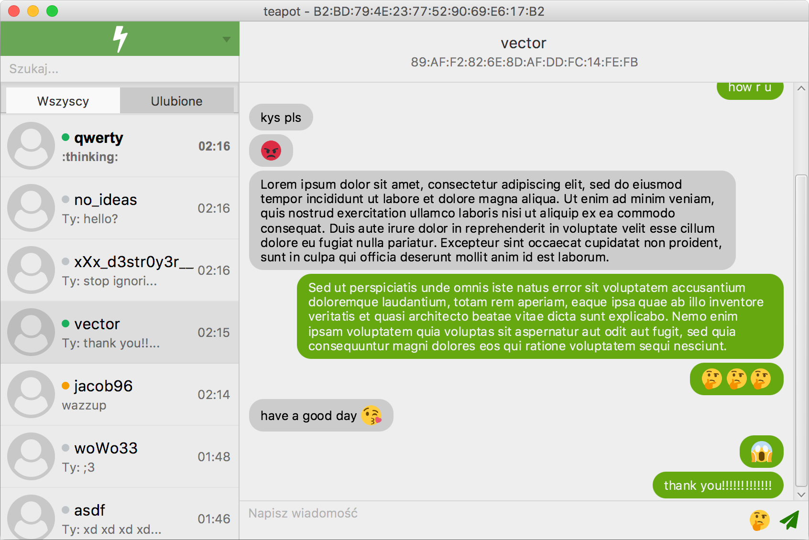

# Conn 

*Student project*

Another instant messenger with end-to-end encryption.

## Requirements

- Oracle Java 8-10
- OpenJDK with OpenJFX has not been tested
- Server requires PostgreSQL database

## Compiling

    ./generate-protos.sh    # Generate protobuf classes
    mvn clean install       # Compile everything

## Basic usage

    ./generate-ssl-keys.sh  # Generate keystore for testing
    ./start-server.sh       # Run server, you need to configure database access
    ./start-client.sh       # Run client with localhost as target server

## Legal

- Project code is licensed under the [MIT license](https://opensource.org/licenses/MIT)

- [FontAwesome](https://fontawesome.com/license) is licensed under [SIL OFL 1.1](http://scripts.sil.org/cms/scripts/page.php?site_id=nrsi&id=OFL)

- [Twemoji](https://github.com/twitter/twemoji) by Twitter are licensed under [CC BY 4.0](https://creativecommons.org/licenses/by/4.0/)

- [Message alert tone](https://freesound.org/people/RICHERlandTV/sounds/351540/) by RICHERlandTV is licensed under [CC BY 3.0](https://creativecommons.org/licenses/by/3.0/)
